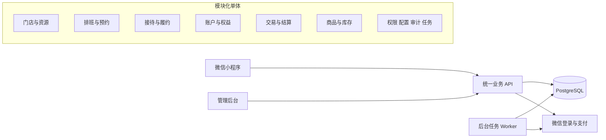
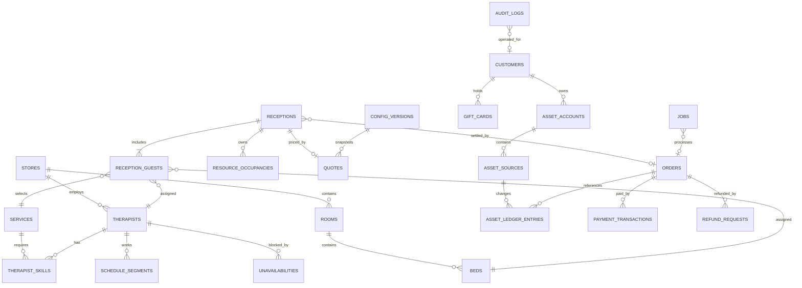
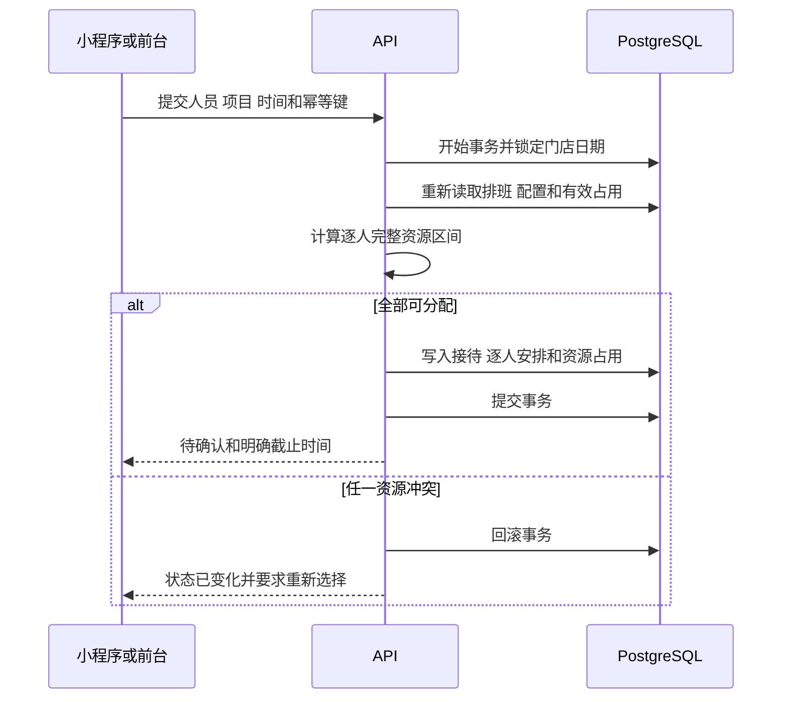
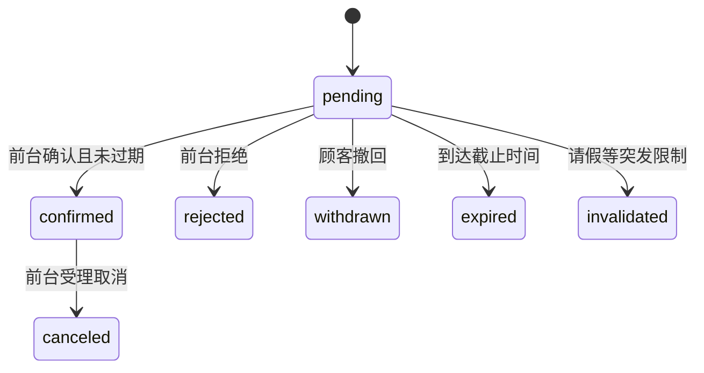

# 得闲小程序与管理系统技术设计 V1

## 1 文档状态

- 状态：补充后复核
- 技术栈：已确认，可据此启动工程基础建设
- 适用范围：阜阳单店一期
- 设计目标：优先证明预约资源、资金权益和关键状态在并发及失败情况下仍然正确
- 需求依据：《得闲SPA业务需求与产品方案V1》中的业务编号、验收场景和本轮技术审核意见

生产价格、分钟数、会员门槛和退款数值可以后续配置。本设计先固定支持的规则类型、事务边界、历史版本和异常恢复方式。

## 2 技术选型

| 层级       | 选型                                   | 约束                                             |
| ---------- | -------------------------------------- | ------------------------------------------------ |
| 微信小程序 | 微信原生框架、TypeScript               | 不引入跨端框架；以微信开发者工具和真机结果为准   |
| 管理后台   | Vue 3、Vite、TypeScript、Element Plus  | 优先实现运营人员的今日待办和高频处理路径         |
| 业务后端   | Node.js 24 LTS、Fastify、TypeScript    | 模块化单体；所有入口复用同一业务服务             |
| 接口校验   | JSON Schema、TypeBox                   | TypeScript 类型不代替运行时输入校验              |
| 数据库     | PostgreSQL                             | 使用事务、约束、行锁和事务级 advisory lock       |
| 数据访问   | Drizzle ORM、必要的受控原生 SQL        | 迁移文件进入版本库；锁和范围约束允许使用原生 SQL |
| 包管理     | pnpm workspace                         | 固定 pnpm 和 Node.js 版本并提交锁文件            |
| 测试       | Vitest、Fastify inject、数据库集成测试 | 预约竞争和资金操作必须执行真实数据库并发测试     |

一期不使用微服务、Redis、Kafka 或 Kubernetes。后台任务先使用 PostgreSQL 持久化任务表和独立 worker 进程；worker 与 API 使用同一份代码和数据库。

## 3 系统边界与模块



| 模块       | 职责                                             | 不负责                     |
| ---------- | ------------------------------------------------ | -------------------------- |
| 门店与资源 | 房间、床位、美容师、技能、项目和设备             | 预约状态、资金变化         |
| 排班与预约 | 排班、请假、可约计算、预占、确认、改期和资源冲突 | 服务是否真实完成、是否收款 |
| 接待与履约 | 到店、实际开始结束、超时、中止和完成核实         | 推断支付成功               |
| 账户与权益 | 余额来源、奖励金、礼品卡、会员贡献值             | 微信现金支付结果           |
| 交易与结算 | 报价、订单、支付、核销、退款和资金流水           | 自动确认预约、自动交付商品 |
| 商品与库存 | 商品、规格、库存、购物车和到店交付               | 快递和物流                 |
| 系统支持   | 登录、角色权限、配置版本、审计、任务和异常待办   | 绕过其他模块业务规则       |

现场接待可以没有会员账户，也可以暂时没有支付订单。后续关联会员时必须验证归属，不能仅根据手填手机号合并资产。

## 4 建议仓库结构

```text
apps/
  api/              Fastify API 与 worker
  admin/            Vue 管理后台
  miniprogram/      微信原生小程序
docs/
  technical-design-v1.md
pnpm-workspace.yaml
package.json
```

暂不建立通用工具库和复杂分层。出现三个以上稳定复用点后再提取共享包。

## 5 核心数据关系



核心表均包含 `id`、`created_at`、`updated_at`。业务记录使用不可预测的 ID；时间以带时区时间戳保存，业务展示和日期锁按 `Asia/Shanghai` 计算。

## 6 预约资源占用模型

### 6.1 统一占用

线上申请、电话代约、现场预占、已确认接待、改期和不可用变更都写入或检查同一套资源占用模型。

`resource_occupancies` 至少保存：

| 字段                     | 含义                                               |
| ------------------------ | -------------------------------------------------- |
| `store_id`               | 门店                                               |
| `resource_type`          | therapist、bed、room、equipment                    |
| `resource_id`            | 被占用资源                                         |
| `start_at`、`end_at`     | 左闭右开时间区间                                   |
| `occupancy_kind`         | prepare、service、cleanup、rest、hold、unavailable |
| `owner_type`、`owner_id` | 接待、请假、培训、故障等来源                       |
| `active`                 | 是否参与冲突判断                                   |
| `expires_at`             | 临时保留的明确截止时间，可为空                     |

有效临时保留的判断始终包含 `expires_at > now()`。清理任务延迟不影响即时到期语义。

### 6.2 并发控制方案

单店一期采用“事务级门店日期锁 + 提交时重算 + 数据库约束”的保守方案。

1. 根据所有客户的准备、服务、整理、休息和资源清洁计算真实占用区间。
2. 找出涉及的门店营业日期；跨午夜时包含相邻日期。
3. 按日期升序获取 PostgreSQL 事务级 advisory lock，锁键由 `store_id + local_date` 稳定计算。
4. 在锁内重新读取已发布排班、请假、配置和当前有效占用。
5. 对多人接待一次性分配全部美容师、床位、房间和设备。
6. 任一客户无法安排则回滚整个事务，不留下部分占用。
7. 插入接待、逐人安排和全部占用记录后提交。

所有会改变可约结果的写操作使用同一锁协议，包括：

- 创建和确认预占；
- 前台直接接待；
- 改期、换人、换床和取消；
- 发布排班；
- 登记或撤销请假、培训、停业和设备故障；
- 登记实际超时。

跨多个日期时始终按稳定顺序获取锁，减少死锁。发生序列化错误、死锁或约束冲突时，服务端只进行有限次数短重试，最终返回可解释的“资源状态已变化”。事务内禁止调用微信支付、发送通知或执行其他外部网络请求。

数据库同时对同一基础资源的重叠有效占用建立排斥约束，作为应用逻辑之外的最后防线。房间独占与床位共享涉及父子资源关系，仍由日期锁内的统一查询负责判断：

- 按床使用时占用具体床位；
- 整房独占时占用房间并检查其全部床位；
- 已存在任一床位占用时不得新增整房独占；
- 房间已独占时不得新增该房内任一床位占用。

### 6.3 创建预占时序



### 6.4 改期

改期事务同时锁定原日期与目标日期。锁内先校验记录版本和目标资源，再停用原占用并写入新占用；任何一步失败都整体回滚，因此原安排保持有效。客户端不能先取消原安排再创建新安排。

## 7 状态分离

### 7.1 接待确认状态



### 7.2 服务事实状态

`not_started -> arrived -> in_service -> completed_verified`

`in_service -> terminated` 表示中途结束。预计时间经过不自动改变服务事实状态；实际超时由前台记录，并产生受影响接待清单。

### 7.3 交易和履约状态

- 收款：`unpaid`、`processing`、`paid`、`payment_unknown`、`partially_refunded`、`refunded`。
- 商品履约：`awaiting_pickup`、`delivered`、`returned`。
- 服务履约：`awaiting_service`、`awaiting_settlement`、`settled`。
- 退款：`requested`、`approved`、`processing`、`succeeded`、`failed`、`unknown`、`rejected`。

取消接待、退款成功、服务完成和商品交付分别写入各自状态，禁止互相隐式代替。

每个修改接口都要求：

- 校验当前状态和操作者权限；
- 接收幂等键或记录版本；
- 在同一事务中更新状态、业务记录和审计事件；
- 重复成功请求返回原结果；
- 相同幂等键但参数不同返回冲突错误。

## 8 资金与权益模型

### 8.1 金额与来源

所有人民币金额使用整数分 `bigint` 保存，对外格式化为两位小数。比例和分摊使用明确规则计算，最后一项承担合法舍入尾差，保证明细之和等于总额。

客户资产不只保存一个余额字段：

- `asset_accounts`：余额、奖励金等账户及可用和冻结汇总；
- `asset_sources`：每次充值、礼品卡领取、奖励发放形成的具体来源；
- `asset_ledger_entries`：不可删除的入账、冻结、解冻、消费、恢复和调整流水；
- `asset_allocations`：订单消费使用了哪些来源及金额。

账户汇总是受事务保护的快速查询值，流水和来源是核对依据。禁止通过直接修改账户汇总办理正常业务。

### 8.2 充值示例

“实付 95 元、到账 100 元”保存为：

- 支付交易现金实付：9500 分；
- 充值资产来源入账：10000 分；
- 优惠差额：500 分；
- 支付渠道交易号唯一；
- 充值业务幂等键唯一；
- 重复回调查询并返回既有入账结果。

支付回调先验证签名、商户号、金额和订单归属，再在数据库事务内登记支付结果和资产入账。网络响应失败不会撤销已提交事务，微信可安全重试。

### 8.3 消费核销

1. 锁定订单、客户账户和将要使用的资产来源，统一按 ID 升序加锁。
2. 校验服务事实、订单应收、可用金额和请求幂等键。
3. 按已发布的资金使用顺序建立来源分配。
4. 写入消费流水并更新汇总。
5. 将订单结算状态更新为成功。

上述步骤在一个事务中完成。余额不足时整体失败，不产生部分扣款；是否支持混合微信支付后续按配置开放。

### 8.4 礼品卡

礼品卡保存原购买订单、付款人、当前持有人、面额、状态和版本号。领取使用带状态条件的更新：只有 `available` 或 `pending_receive` 状态能转为 `received`，并在同一事务中生成接收者资产来源。

领取、到期退回和退款竞争时锁定同一礼品卡记录。事务成功后卡权益与余额只存在一个可消费出口。

### 8.5 退款

退款分为服务订单退款、余额消费恢复、充值退余和礼品卡退款，不共用无差别金额入口。

退款申请创建时：

- 保存原订单和原规则版本；
- 锁定或冻结本次涉及的来源金额；
- 保存计算预览及分摊；
- 创建可重试的微信退款任务；
- 结果未知时保持冻结并继续查询。

微信退款确认成功后，按原来源写入恢复或现金退款流水。充值退余与订单消费退款不能对同一价值同时恢复余额并退现金。

具体退款算法仍为待配置，但实现前必须为每一种启用算法提供可演算样例和测试。

## 9 配置版本

配置采用有限规则类型，不建设通用公式编辑器。

配置版本至少包含：

- `draft`、`published`、`disabled` 状态；
- 生效时间和适用门店、项目或人员范围；
- 创建人、发布人和变更原因；
- 可机器校验的规则内容；
- 不可修改的历史版本。

报价、订单、充值、礼品卡、退款和预占截止时间保存所用配置版本或计算快照。发布新配置不重算已有业务记录。缺少有效配置时关闭受影响入口并在后台生成明确缺项，禁止默认全天可约、零元服务或任意可退。

## 10 后台任务与恢复

`jobs` 表至少保存任务类型、业务对象、去重键、计划执行时间、状态、尝试次数、租约到期时间和最后错误。

worker 处理规则：

1. 使用 `FOR UPDATE SKIP LOCKED` 领取到期任务。
2. 设置短租约后提交领取事务。
3. 执行业务动作时再次校验当前业务状态。
4. 成功写入完成结果；失败按退避时间重试。
5. 进程崩溃后，租约过期任务可被重新领取。
6. 去重键和业务幂等约束保证重复执行安全。

首期任务包括排班补齐、过期预占清理、礼品卡到期、支付退款查询、奖励发放和通知重试。预占到期由实时业务判断，清理任务只负责物理状态整理和待办生成。

## 11 权限与审计

- 顾客只能访问本人订单、预约和资产。
- 前台可以确认接待、核销和交付，但退款、人工改价、资产调整按独立权限控制。
- 排班人员可以处理排班和请假，不自动获得资金权限。
- 店长权限仍可按具体动作拆分，并支持金额阈值。
- 所有服务端接口执行身份、归属、权限、状态和版本校验，页面隐藏按钮不算权限控制。

确认、拒绝、改期、换资源、排班发布、请假、核销、退款、改价和资产调整写入审计日志，记录操作者、原因、前后内容、业务对象和请求追踪号。

## 12 接口约定

接口统一使用 `/api/v1` 前缀。错误响应至少包含：

```json
{
  "code": "RESOURCE_STATE_CHANGED",
  "message": "所选时间已不可预约，请重新选择",
  "requestId": "...",
  "details": {}
}
```

第一阶段接口清单：

| 端     | 方法与路径                                     | 用途                   |
| ------ | ---------------------------------------------- | ---------------------- |
| 小程序 | `GET /api/v1/store`                            | 门店信息               |
| 小程序 | `GET /api/v1/services`                         | 服务项目               |
| 小程序 | `POST /api/v1/availability/search`             | 查询可约结果           |
| 小程序 | `POST /api/v1/receptions`                      | 创建待确认申请         |
| 小程序 | `GET /api/v1/receptions/:id`                   | 查询接待详情和实时状态 |
| 小程序 | `POST /api/v1/receptions/:id/withdraw`         | 撤回待确认申请         |
| 后台   | `GET /api/v1/admin/dashboard`                  | 今日待办               |
| 后台   | `GET /api/v1/admin/calendar`                   | 日预约与资源占用       |
| 后台   | `POST /api/v1/admin/receptions/:id/confirm`    | 确认接待               |
| 后台   | `POST /api/v1/admin/receptions/:id/reject`     | 拒绝申请               |
| 后台   | `POST /api/v1/admin/receptions/:id/reschedule` | 原子改期               |
| 后台   | `POST /api/v1/admin/receptions/direct`         | 直接确认现场接待       |
| 后台   | `POST /api/v1/admin/schedules/publish`         | 整体发布日期排班       |
| 后台   | `POST /api/v1/admin/unavailabilities`          | 登记请假或故障         |

资金、商品和会员接口在相应阶段补充，先不为尚未实现的功能建立空接口。

## 13 管理后台交互原则

后台首页按运营动作排序：

1. 即将到期的待确认申请；
2. 已确认接待冲突；
3. 即将开始和待核实完成的接待；
4. 待收款和异常支付；
5. 待取货；
6. 后台任务与配置缺项。

操作按钮使用业务结果命名，例如“确认接待”“拒绝申请”“确认消费并扣款”“确认商品已交付”。提交前展示影响，提交后显示实际状态；结果未知时不显示成功。

## 14 测试与验收

### 14.1 必须自动化的测试

- 两个事务同时抢同一美容师或床位，最多一个成功；
- 多人接待任一资源失败时没有残留占用；
- 改期失败后原占用仍然有效；
- 确认与到期同时发生时只有一个最终状态；
- 95 元支付生成 100 元余额，重复回调只入账一次；
- 两笔消费竞争同一余额不透支；
- 礼品卡领取、到期和退款竞争时价值只转移一次；
- 任务重复领取和进程重启不重复执行业务结果；
- 修改配置后历史报价和资金记录保持原口径。

### 14.2 人工验收

需求文档 AT01 至 AT26、FT01 至 FT16 全部建立对应测试记录。每个记录包含测试配置、请求步骤、数据库结果和页面表现。

## 15 部署与环境

- `development`、`test`、`production` 使用独立数据库和微信配置。
- 密钥只来自环境变量或部署平台的密钥存储，不进入仓库和普通日志。
- 数据库结构只通过版本化迁移发布。
- 发布前执行迁移预检、自动化测试和备份。
- 初期部署为 API、worker、管理后台静态站点和 PostgreSQL。
- API 与 worker 使用同一构建产物，可分别启动和回滚。
- 备份恢复至少在测试环境演练一次，并核对订单、资金流水和占用记录。

## 16 分步实施计划

| 阶段 | 交付内容                                   | 通过条件                       |
| ---- | ------------------------------------------ | ------------------------------ |
| 0    | 工程初始化、环境检查、健康接口、数据库迁移 | 三端可启动，测试可执行         |
| 1    | 门店、资源、服务和排班基础数据             | 可录入 8 房、床位、8 人及技能  |
| 2    | 可约计算和待确认预约                       | 并发抢占和多人原子性测试通过   |
| 3    | 后台工作台、确认、改期、请假和冲突         | 预约 AT 核心场景通过           |
| 4    | 接待事实、报价、订单和商品到店交付         | 状态分离和重复交付测试通过     |
| 5    | 微信支付、充值、余额核销和流水             | 95 付 100 入及重复回调测试通过 |
| 6    | 礼品卡和退款                               | 权益竞争和退款恢复测试通过     |
| 7    | 会员、评价、邀请和运营配置                 | 奖励来源、用途和回退可追溯     |
| 8    | 全量验收、部署、恢复演练和运营交接         | AT、FT、权限和恢复检查通过     |

## 17 待业务确认但不阻塞阶段 0 的事项

- 是否已有微信小程序 AppID 和支付商户号；
- 多人预约是否允许不同时长、分房或不同开始时间；
- 双床房是否允许非同行客户共享；
- 普通消费是否支持余额、奖励金和微信混合支付；
- 充值退余、礼品卡部分使用和已用奖励的具体算法；
- 商品是否坚持整单领取；
- 门店实际营业时间和前台可处理线上申请的时间段。

以上事项未确认时使用明确标注的测试配置，不将测试值作为生产默认值。
